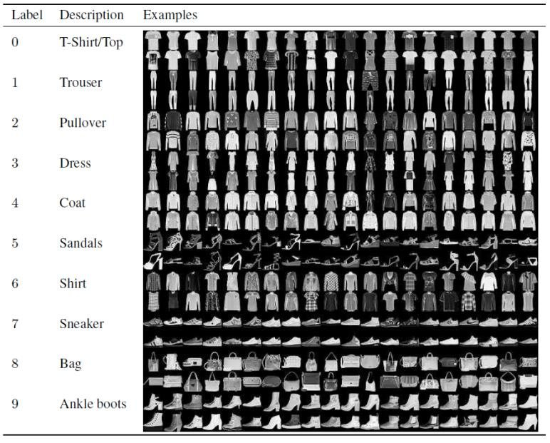
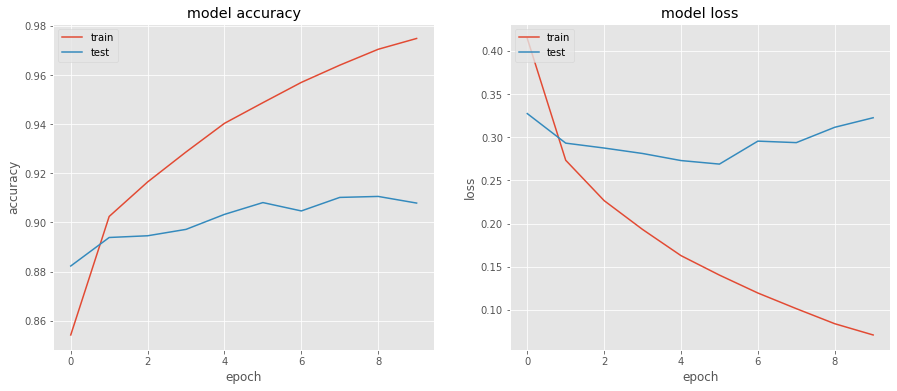

# Fashion-Image-Recognition-with-CNN
## Overview

## Code and Resources Used

**Programming Language:** Python  
**Packages:** tensorflow, keras, matplotlib, scikit-learn  
**Dataset Source:** Fashion MNIST dataset imported from keras

## Model Building

First I scaled the feature data to improve the training of the models, then I split the data into training and test sets with the test set percentage being 33%. Then I trained three models to compare and find the best model.

The three different models were:
* **Multinomial Logistic Regression** - A comparative baseline model.
* **Random Forest Classifier** - Since higher and lower qualities were relatively rare in the data, I thought the Random Forest model could deal well with this sparsity.
* **Decision Tree Classifier** - Simple to understand and interpret, while usually performing well in classification problems.

Then I used grid search cross-validation to tune the hyperparameters and reach the best model.

## Model Performance

The Random Forest classifier outperformed the other models since it had the highest accuracy by far.

* **Random Forest:** Accuracy = 67% 
* **Multinomial Logistic Regression:** Accuracy = 63% 
* **Decision Tree:** Accuracy = 56%   

